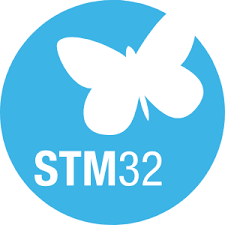
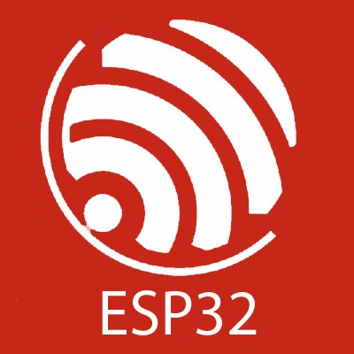
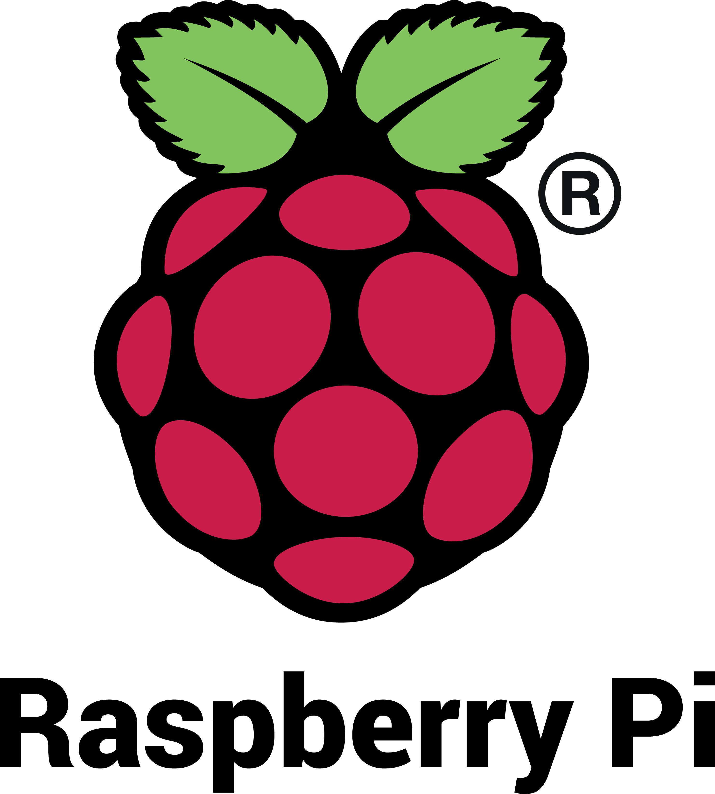
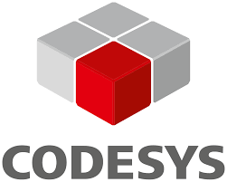
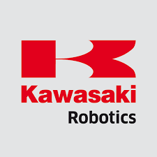

  

<h3 align="center">
Embedded Robotics • Industrial Automation • Computer Vision • Electronics Engineering
</h3>

  <a href="https://staudtmedia.com/portfolio">Portfolio</a> 
  <a href="https://www.linkedin.com/in/jakub-staudt">LinkedIn</a>
  <a href="mailto:jakubstaudt@gmail.com">jakubstaudt@gmail.com</a>

---

## About Me

I’m an Electronics Engineer and Master’s student in Automation & Robotics at Wrocław University of Science and Technology, focused on building systems that combine hardware, software, and intelligent automation.

Most of my work sits at the intersection of:

- Embedded systems
- Robotics
- Computer vision
- Industrial automation
- AI-assisted engineering

---

# Tech Stack

  
  
  
  
  
  
  
  
  
  
  
  
  
  
  
  
  

---

# Certifications

- Kawasaki Industrial Robot Programming — ASTOR Academy
- PLC/HMI Programming — ASTOR Academy
- Cisco CCNAv7 Routing & Switching

