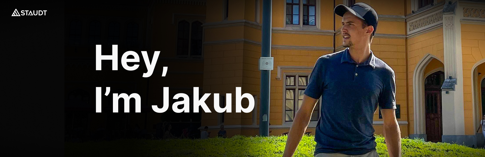

  

<h3 align="center">
Embedded Robotics • Industrial Automation • Computer Vision • Electronics Engineering
</h3>

  <a href="https://staudtmedia.com/portfolio">Portfolio</a> 
  <a href="https://www.linkedin.com/in/jakub-staudt">LinkedIn</a>

---

## About Me

I’m an Electronics Engineer and Master’s student in Automation & Robotics at Wrocław University of Science and Technology, focused on building systems that combine hardware, software, and intelligent automation.

Most of my work sits at the intersection of:

- Embedded systems
- Robotics
- Computer vision
- Industrial automation
- AI-assisted engineering

I enjoy building projects that move beyond simulations and actually interact with the physical world, robots, sensors, actuators, motor controllers, industrial communication, and real-time systems.

Over the past years I’ve worked on:

- Industrial robotic systems using Kawasaki 6-axis robots
- Embedded systems with STM32, ESP32 and FreeRTOS
- ROS2 robotics applications
- Computer vision systems using OpenCV and YOLO
- PCB design and low-level electronics development
- Motorsport electrical systems for an electric racing motorcycle
- AI/automation projects combining software and hardware

I tend to work comfortably across disciplines, from electronics and firmware to mechanical integration and software architecture.

---

## Current Focus

- Embedded Robotics
- ROS2 development
- Industrial automation systems
- Computer vision for robotics
- Real-time embedded systems
- AI integration into robotics workflows
- Robotics simulation and digital twins

---

# Tech Stack

## Embedded Systems

  
  
  
  

- STM32
- ESP32
- FreeRTOS
- UART / SPI / I2C
- Embedded Linux
- Low-level firmware development

---

## Robotics & Automation

  
  

- ROS2
- Kawasaki AS Language
- PLC / HMI programming
- CODESYS
- Industrial robotics
- Sensor integration
- Motion systems
- Fusion 360
- 3D Printing

---

## Computer Vision & AI

  
  

- OpenCV
- YOLO
- Roboflow
- Real-time object detection
- AI-assisted robotics systems

---

## Hardware & PCB Design

  

- Altium Designer
- PCB schematic design
- Signal validation
- Oscilloscope debugging
- Analog & digital electronics
- Power systems
- Telemetry systems

---

# Selected Projects

## EV Battery Stacking Robot

Industrial robotic station built during internship at ASTOR using:

- Kawasaki RS007N 6-axis robot
- Astraada One PLC
- CODESYS
- HMI integration
- Custom mechanical components

The robot autonomously stacked EV battery modules into a 3x3 tray configuration with integrated safety systems and industrial control logic.

---

## Electric Motorsport Motorcycle Harness

Designed the electrical harness architecture for the LEM Hadron electric racing motorcycle competing in MotoStudent 2025 in Spain.

Key responsibilities included:

- Telemetry architecture
- Sensor integration
- Wiring system design
- Technical documentation
- System modularity

---

## VR Motion Controller with ESP32

Built a Meta Quest-compatible motion controller using:

- ESP32
- Accelerometer sensors
- Bluetooth HID
- ROS2 communication

The system transmitted orientation and motion data in real time for robotics and VR experimentation.

---

## Warehouse Detection System

Computer vision pipeline for detecting warehouse boxes in real time using:

- Python
- OpenCV
- YOLO
- Custom dataset training with Roboflow

Focused on optimizing detection thresholds and improving inference consistency.

---

# Experience

## ASTOR Robotics Internship

Worked on industrial robotics systems involving:

- Kawasaki robot programming
- PLC logic
- HMI development
- Industrial safety systems
- Electrical integration
- Mechanical prototyping

This was where I transitioned from mostly academic engineering into full industrial system integration.

---

# Certifications

- Kawasaki Industrial Robot Programming — ASTOR Academy
- PLC/HMI Programming — ASTOR Academy
- Cisco CCNAv7 Routing & Switching

---

# Beyond Engineering

Outside engineering, I’ve also built and run a marketing and automation agency, which gave me experience in:

- Business strategy
- Communication
- Systems thinking
- Leadership
- Client management

That combination of technical and entrepreneurial experience tends to shape how I approach engineering problems, with a strong focus on practical implementation and usability.

---

# What I Like Building

- Robots that interact with real environments
- Embedded systems with visible physical outputs
- Computer vision systems connected to hardware
- Automation systems that solve operational problems
- Fast MVP-style technical prototypes
- Projects that combine multiple engineering disciplines

---

# Contact

📍 Wrocław, Poland  
📧 jakubstaudt@gmail.com  

🌐 Portfolio:  
https://staudtmedia.com/portfolio

💻 GitHub:  
https://github.com/jakub-staudt

🔗 LinkedIn:  
https://linkedin.com/in/jakub-staudt

---

  <i>
    Building systems where software meets hardware.
  </i>

